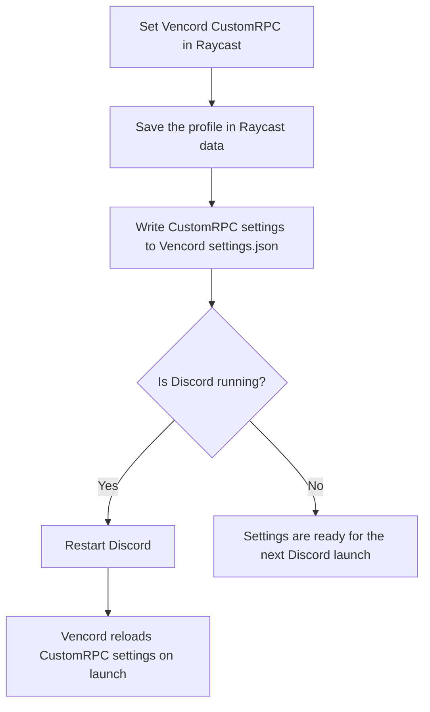

# Vencord CustomRPC Integration

Control and customize your Discord Rich Presence directly from Raycast.

**IMPORTANT NOTE:** This extension does *not* provide a standalone custom rich presence. It is specifically built for and requires the [CustomRPC plugin](https://github.com/Vencord/Vencord/tree/main/src/plugins/customRPC) from [Vencord](https://vencord.dev/). **If you do not use Vencord with the CustomRPC plugin enabled, this extension will not work for you.**

## Features

- **Vencord Integration**: Reads from and writes to your current CustomRPC settings inside Vencord (supports Discord Stable, PTB, Canary, and Vesktop).
- **Automatic Discord Restart**: Restarts running Discord/Vesktop clients after updating Vencord settings so the cached CustomRPC state is refreshed.
- **Profiles & Presets**: Keep track of your last-used profiles per Application ID and save reusable configurations to load instantly.
- **Easy Toggle**: Set your Rich Presence or disable Vencord's CustomRPC plugin from Raycast.

## Prerequisites

- [Discord](https://discord.com/) or [Vesktop](https://vencord.dev/vesktop/) must be installed and running locally.
- [Vencord](https://vencord.dev/) must be installed (built into Vesktop, or installed separately into Discord).
- The **CustomRPC** plugin must be enabled in your Vencord settings.
- **Activity Sharing** must be enabled in your Discord settings (`Settings` -> `Activity Privacy` -> `Share your detected activities with others`).

## Getting Started

1. Open the **Set Vencord CustomRPC** command.
2. Enter your **Application ID** or paste an existing one. If you have Vencord configured with CustomRPC, the fields will auto-fill from your existing settings.
3. Configure your custom presence (App Name, Details, State, Images, Buttons).
4. Hit `Cmd/Ctrl + Enter` to **Set Vencord CustomRPC**. If Discord is running, the extension restarts it so Vencord reloads the updated settings.

## How Updates Are Applied

### Presets

You can save your current configuration as a preset for the current App ID. Open the action menu and select **Save as Preset**. Later, you can load it using the **Load Preset** dropdown menu.

## Stopping Rich Presence

Use the **Stop Vencord CustomRPC** command to disable the CustomRPC plugin in Vencord's `settings.json` and automatically restart Discord so the change takes effect immediately.

## Known Limitations

- **Vencord In-Memory State**: Vencord caches its settings and plugin enabled state in memory while Discord is running. Raycast writes the updated CustomRPC settings to disk, then restarts Discord when it is running so Vencord reloads those settings.
